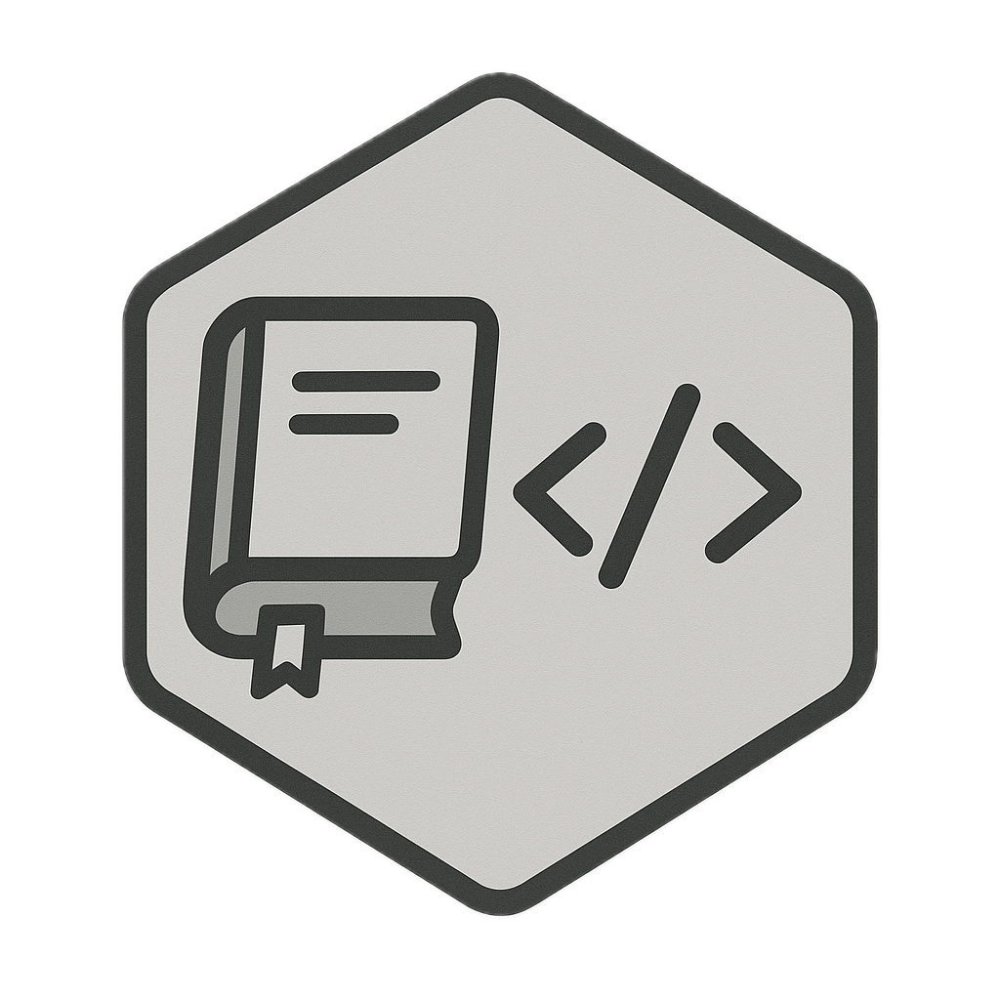
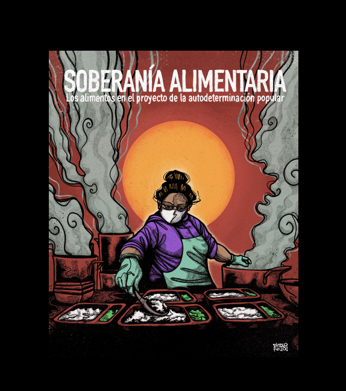

<!-- Animaciones opcionales -->
<link rel="stylesheet" href="https://cdnjs.cloudflare.com/ajax/libs/animate.css/4.1.1/animate.min.css">

<!-- Estilos compactos y reutilizables -->
<style>
:root{
  --card-gap: 1rem;
  --card-radius: 8px;
  --img-aspect: 16 / 9;
  --img-height: 140px;
  --btn-bg: #0d6efd;
  --badge-bg: #6c757d;
  --max-width: 1100px;
}

.cards-grid{
  display: grid;
  grid-template-columns: repeat(auto-fit, minmax(220px, 1fr));
  gap: var(--card-gap);
  max-width: var(--max-width);
  margin: 0 auto;
  padding: 1rem;
}

.project-card{
  background:#fff;
  border:1px solid rgba(0,0,0,.06);
  border-radius: var(--card-radius);
  overflow:hidden;
  display:flex;
  flex-direction:column;
  transition: transform .15s ease, box-shadow .15s ease;
  min-height: 300px;
}

.project-card:hover{
  transform: translateY(-6px);
  box-shadow: 0 10px 28px rgba(12,12,12,.08);
}

/* Contenedor de la imagen: mantiene proporción y asegura que la imagen cubra el área */
.card-img-wrap{
  width:100%;
  aspect-ratio: var(--img-aspect);
  height: var(--img-height); /* fallback para navegadores sin aspect-ratio */
  overflow:hidden;
  background:#f6f6f6;
  display:block;
}

/* La img ocupa todo el contenedor y se recorta manteniendo el foco central */
.card-img{
  width:100%;
  height:100%;
  object-fit:cover;
  object-position:center;
  display:block;
  border-bottom: 1px solid rgba(0,0,0,.03);
}

/* Soporte para navegadores antiguos (padding-top técnica) */
.card-img-wrap.fallback {
  position: relative;
  height: 0;
  padding-top: calc(100% / (var(--img-aspect)));
}
.card-img-wrap.fallback img.card-img{
  position: absolute;
  top:0; left:0; width:100%; height:100%;
}

/* Cuerpo y tipografía */
.card-body{
  padding: .75rem;
  display:flex;
  flex-direction:column;
  gap:.5rem;
  flex:1 1 auto;
}

.meta .badge{
  display:inline-block;
  padding:.2rem .5rem;
  font-size:.72rem;
  border-radius:999px;
  background: var(--badge-bg);
  color:#fff;
}

.card-title{
  margin:0;
  font-size:1rem;
  line-height:1.2;
  font-weight:700;
  color:#111;
}

.card-text{
  font-size:.87rem;
  color:#333;
  margin-top:.25rem;
  flex:1 1 auto;
  overflow:hidden;
}

.card-actions{
  display:flex;
  gap:.5rem;
  align-items:center;
  margin-top:.5rem;
}

.btn{
  display:inline-block;
  background:var(--btn-bg);
  color:#fff;
  padding:.4rem .65rem;
  font-size:.88rem;
  border-radius:6px;
  text-decoration:none;
}

.btn:hover{ background:#0b5ed7; }

@media (max-width:420px){
  :root{ --img-height:120px; }
  .project-card{ min-height: 280px; }
}
</style>

```{=html}
<section class="cards-grid" aria-label="Proyectos">

  <article class="project-card animate__animated animate__fadeIn" title="Apuntes">
    <figure class="card-img-wrap">
      
    </figure>

    <div class="card-body">
      <div class="meta"><span class="badge">Python, IA</span></div>

      <h3 class="card-title">Centro de apuntes</h3>

      <p class="card-text">
        Libro electrónico donde voy registrando los apuntes de los cursos que voy haciendo.
      </p>

      <div class="card-actions">
        <a class="btn" href="https://jona-s99.github.io/book-cursos/" target="_blank" rel="noopener">Ver apuntes</a>
      </div>
    </div>
  </article>

  <article class="project-card animate__animated animate__fadeIn" title="Bookdown D&A">
    <figure class="card-img-wrap">
      
    </figure>

    <div class="card-body">
      <div class="meta"><span class="badge">R</span></div>

      <h3 class="card-title">Bookdown D&A</h3>

      <p class="card-text">
        Libro electrónico con herramientas y automatizaciones en R desarrolladas para Datavoz. Proyecto de práctica profesional para el título de Sociólogo (UDP).
      </p>

      <div class="card-actions">
        <a class="btn" href="https://jona-s99.github.io/Bookdown/" target="_blank" rel="noopener">Libro</a>
      </div>
    </div>
  </article>

  <article class="project-card animate__animated animate__fadeIn" title="Soberanía alimentaria">
    <figure class="card-img-wrap">
      
    </figure>

    <div class="card-body">
      <div class="meta"><span class="badge">Investigación</span></div>

      <h3 class="card-title">Soberanía alimentaria: los alimentos en el proyecto de la autodeterminación popular</h3>

      <p class="card-text">
        Investigación cualitativa del proyecto Fondecyt N°11180099 (dir. Martín Arboleda). Recoge la perspectiva de organizaciones de base sobre problemas y soluciones en los sistemas agroalimentarios.
      </p>

      <div class="card-actions">
        <a class="btn" href="https://transformacionessociales.udp.cl/?publicaciones=soberania-alimentaria-los-alimentos-en-el-proyecto-de-la-autodeterminacion-popular" target="_blank" rel="noopener">Publicación</a>
      </div>
    </div>
  </article>
  
</section>
```